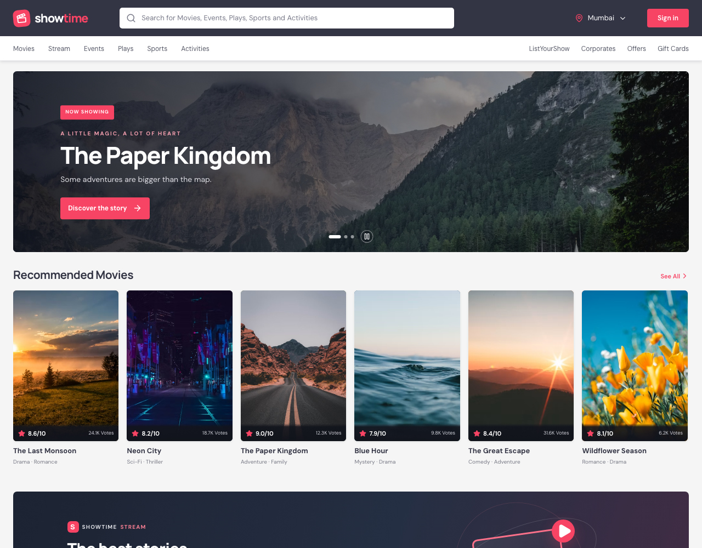
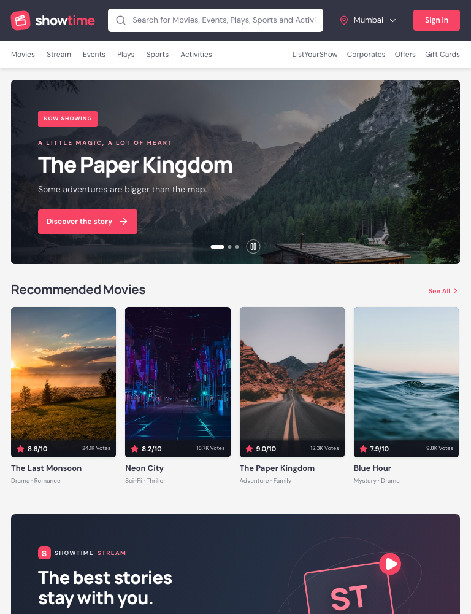
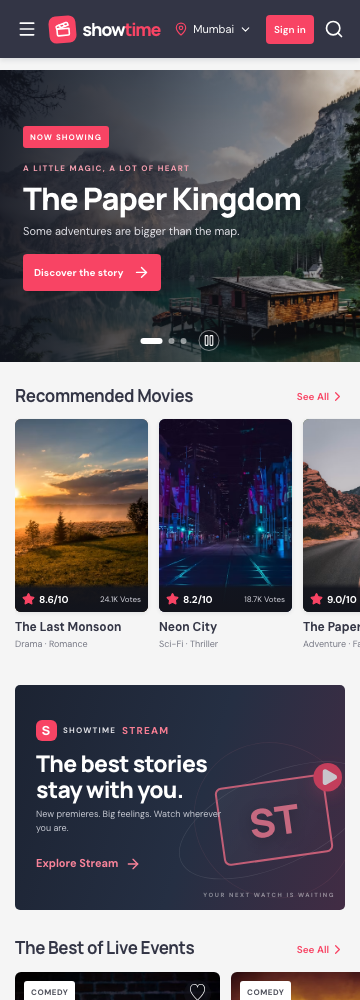

# ShowTime

A responsive movie and live-experience ticket booking demo built with React 18, Vite, React Router, Tailwind CSS, and Lucide icons. ShowTime uses original placeholder branding and made-up titles with free Unsplash imagery. All account, booking, and payment flows are mocked in the browser; no real payment is collected.

## Getting started

Use Node.js 20.19+ or 22.12+.

```bash
npm install
npm run dev
```

Vite prints the local development URL when it starts. `npm start` also launches the Vite app.

## Scripts

| Command | Purpose |
| --- | --- |
| `npm run dev` | Start the Vite development server |
| `npm start` | Start Vite on `0.0.0.0` |
| `npm run build` | Create a production build in `dist/` |
| `npm run preview` | Preview the production build locally |
| `npm run api` | Start the legacy Express/MongoDB API server (optional) |

The React app uses local mock data and does not require MongoDB. The optional API server reads its connection settings from `.env`.

## Main flows

- Pick a city from the header; the selection is saved in `localStorage`.
- Browse 30 fictional movies, filter by language, genre, and format, and open a detail page.
- Browse Events, Plays, Sports, or Activities; each category has date and price filters.
- Browse fictional ShowTime Stream premieres by genre and open their preview cards.
- Browse partner promotions on Offers, filter by category, copy a code, and apply it at checkout. Demo codes: `SHOWTIME10`, `FIRST50`, `NORTHSTAR150`, `WAVE10`, and `CLOUDPERKS`.
- Choose a cinema and showtime, select seats, and complete the mock checkout. No real payment is collected.
- Tickets, profile details, city, and bookings are stored in browser `localStorage`.
- Shared city, auth, and active booking state are available through the React Context API.
- Print the confirmation page to save a ticket PDF. The confirmation includes a generated QR code.

## Routes

| Route | Page |
| --- | --- |
| `/` | Home page |
| `/movies/:city` | Movie list and filters |
| `/movie/:slug` | Movie details |
| `/showtimes/:movieId` | Cinema and showtime selection |
| `/seats/:showtimeId` | Seat map |
| `/checkout` | Booking summary and mock payment |
| `/confirmation/:bookingId` | Booking ticket and QR code |
| `/events`, `/plays`, `/sports`, `/activities` | Experience listings |
| `/stream` | Genre-filtered streaming premieres and mock previews |
| `/offers` | Copyable partner offers and promo codes |
| `/profile`, `/bookings` | Local account details and booking history |

## Project structure

```text
src/
  data/           Mock movie, city, cinema, event, stream, offer, and premiere data
  context/        Shared city, auth, and booking state context
  utils/          Showtime generation and local booking storage
  App.jsx         Routes, shared shell, reusable cards, and page components
  styles.css      Shared design tokens and global styles
  home.css        Home page and carousel styles
  movies.css      Movie listing and detail styles
  booking.css     Showtime, seats, checkout, and confirmation styles
  pages.css       Category listings and account page styles
  phase6.css      Stream library and Offers pages
  main.jsx        React entry point
```

## Screenshots

Captured with Chrome at the listed viewport widths during responsive review.

### Desktop — 1280 px



### Tablet — 768 px



### Mobile — 360 px


